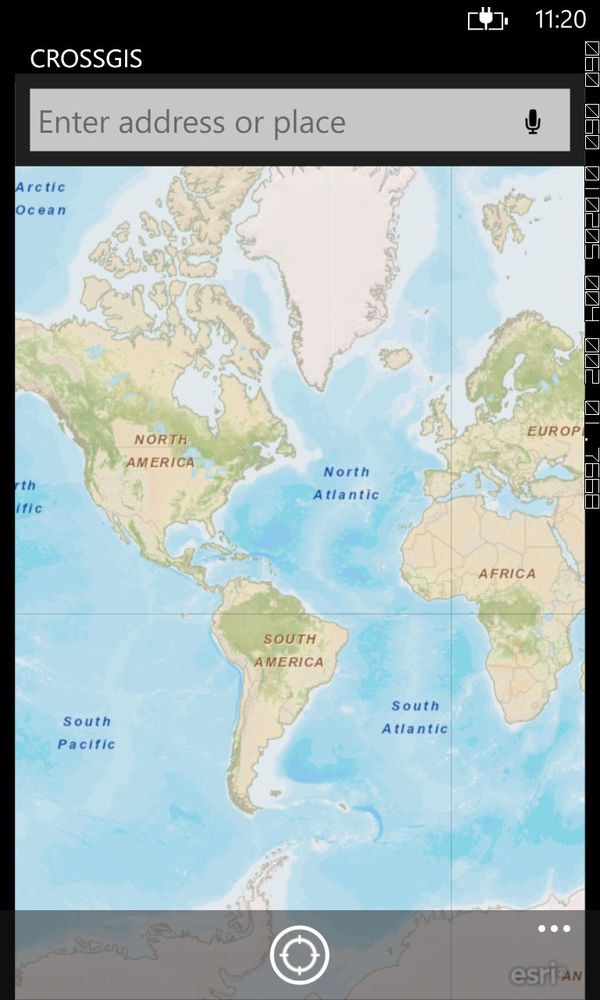
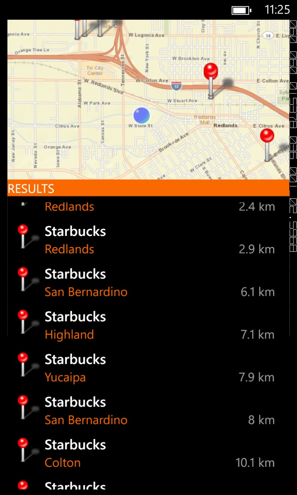
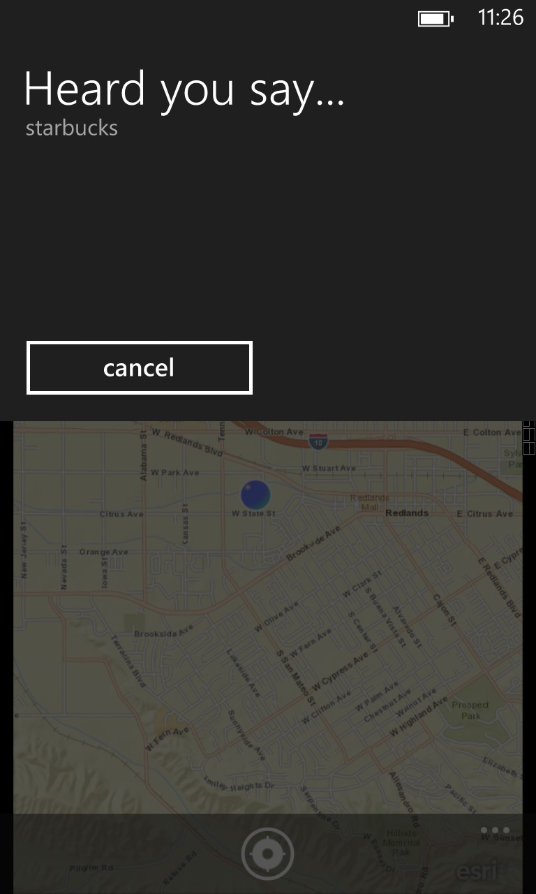
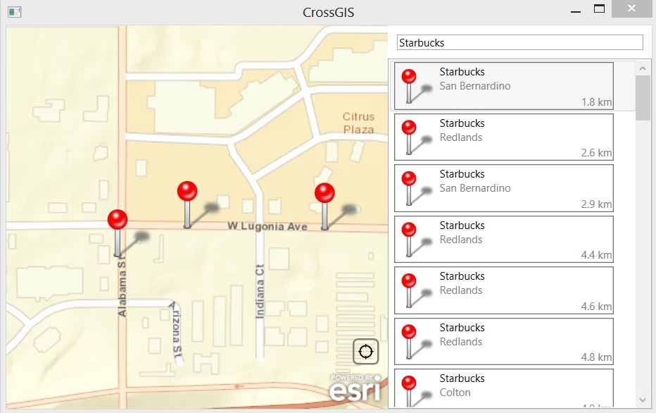

# "Best Development Practices and Patterns Using ArcGIS Runtime SDK for Windows Phone"

This project contains the C# source code of the CrossGIS demo app developed for the Esri DevSummit 2013 Session :
"Best Development Practices and Patterns Using ArcGIS Runtime SDK for Windows Phone"  

## Description

This application demonstrates how to share code logic across Microsoft platforms and device form factors. 
By following common MVVM principles and practices we manage the reuseability of ViewModels across the various
platform Views (WP7, WP8, WPF). Portable class libraries are also used, where possible, in order to be able
to easily share our business logic across platforms. 

## Screenshots

## Instructions 

1. Fork and then clone the repo or download the .zip file. 
2. Download the [ArcGIS Runtime SDK for Windows Phone (requires Esri Global account)](http://www.esri.com/apps/products/download/index.cfm?fuseaction=download.main&downloadid=875).   
3. Download and install the [October 2012 version of the Windows Phone Toolkit](http://phone.codeplex.com/) on CodePlex.
4. In Visual Studio, open the solution ArcGISWindowsPhoneSDK.sln. If necessary, repair the references to the ArcGIS Runtime SDK for Windows Phone assemblies and the Windows Phone Toolkit. 
5. Clean and build the solution, then run the application. 

## Requirements

* [Supported system configurations](http://resources.arcgis.com/en/help/windows-phone-sdk/concepts/index.html#//011v00000025000000)

## Resources

* [ArcGIS Runtime SDK for Windows Phone Resource Center](http://resources.arcgis.com/en/communities/windows-phone-sdk/index.html)
* [ArcGIS Runtime SDK for Windows Phone download (requires Esri Global account)](http://www.esri.com/apps/products/download/index.cfm?fuseaction=download.main&downloadid=875)
* [Cross-Platform Development with the .NET Framework (Portable class libraries] (http://msdn.microsoft.com/en-us/library/gg597391.aspx)
* [Post describing WP7/WP8 Referer issue in detail] (http://atomaras.wordpress.com/2012/11/18/wp7-app-on-wp8-breaking-changes-part-1-webrequests-referer-changes/)
* [Building a Complete Cross- Platform MVVM App with MvvmCross] (http://www.geekchamp.com/articles/building-a-complete-cross--platform-mvvm-app-with-mvvmcross)

## Issues

Find a bug or want to request a new feature?  Please let us know by submitting an issue.

## Contributing

Anyone and everyone is welcome to contribute. 

## Licensing
Copyright 2012 Esri

Licensed under the Apache License, Version 2.0 (the "License");
you may not use this file except in compliance with the License.
You may obtain a copy of the License at

   http://www.apache.org/licenses/LICENSE-2.0

Unless required by applicable law or agreed to in writing, software
distributed under the License is distributed on an "AS IS" BASIS,
WITHOUT WARRANTIES OR CONDITIONS OF ANY KIND, either express or implied.
See the License for the specific language governing permissions and
limitations under the License.

A copy of the license is available in the repository's [license.txt]( https://github.com/atomaras/CrossGIS/blob/master/licence.txt) file.

